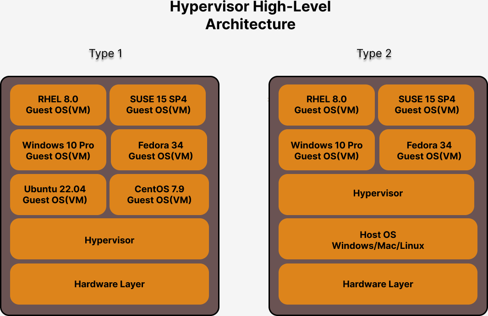

# Day 1

## Cloning this repository in Ubuntu lab machine from terminal
```
cd ~
git clone https://github.com/tektutor/ansible-aug-2024.git
cd ansible-aug-2024
tree
```

Expected output


## Lab - Installing tree utility in Ubuntu lab machine
```
sudo apt update && sudo apt install -y tree
```

## Checking if all the tools required for the training are installed in your lab machine
```
docker --version
docker images
ansible --version
```

Expected output


## Info - Hypervisor Overview
<pre>
- is nothing but virtualization technology
- virtualization allows us to run many Operating System side by side, parallely on the same desktop/laptop/workstation/server
- more than 1 OS can be actively running
- each Virtual Machine(VM) represents a fully function Operating System
- each VM has to allocated with dedicated hardware resources
  - CPU cores
  - RAM
  - Storage ( HDD/SSDs )
  - hence it is called heavy-weight virtualization technology
- Hardware + Software Technology
  - we need Processor supports virtualization
  - AMD
    - Virutualization feature is AMD-V
  - Intel Processor
    - VT-X is the virtualization feature
- there are two types of Hypervisor softwares
  - Type 1 aka Bare-Metal Hypervisors
    - is used in Servers/Workstations
    - Virtual Machines can be created without a Host OS
    - the OS installed within Virtual Machine is called Guest OS
    - examples
      - VMWare vSphere/vCenter
  - Type 2
    - is used in laptops/desktops/workstations
    - this requires a Host OS 
    - hypervisor software is installed on top of Host OS ( Windows, Linux, Mac OS-X )
    - examples
      - Microsoft Hyper-V
      - Oracle Virtualbox ( Free )
      - VMWare Workstation ( Windows & Linux )
      - VMWare Fusion ( Mac OS-X )
      - KVM - opensource ( Linux )
</pre>

## Info - Hypervisor High-Level Architecture


## Info - Docker Overview
<pre>
- lightweight - application virtualization technology  
- Docker is developed in Golang by a company called Docker Inc
- Docker comes in 2 flavours
  1. Docker Community Edition - Docker CE ( Free )
  2. Docker Enteprise Edition - Docker EE ( Paid software )
- each container represents one application or an application component
- each container is an application process
- containers doesn't have its own OS Kernels
- containerd don't get their own hardware resources
- container don't represents an Operating System
- container will never be able to replace virtual machines or Operating System
- similarities between virtual machines and containers
  - each container get's its own IP address just like VMs get their own IP address
  - each container has its own network stack just like VMs
  - each container has its own file system just like VMs
  - each container has its own Port range ( 0 - 655535 ) just like VMs
- client/server architecture
- docker client
  - is the software that we use to interact with docker engine 
- docker server
  - runs as a service in the background
</pre>
## Info - Docker High-Level Architecture


## Info - Docker Image Overview
<pre>
- is a template/blueprint/specification of a docker container
- Docker image is similar to windows-11-dvd.iso file
- Just like using windows dvd iso, we install windows 11 on multiples laptops/desktops, same way using docker image we can create multiple container instances
- Docker Images are stored inside Docker Registry
</pre>

## Info - Docker Container Overview
<pre>
- is an instance of a Docker Image
- is an running instance of an application
- it get's an unique name and ID
- it get's a Private IP by default
</pre>  

## Info - Docker Registry
<pre>
- is a collection of many Docker Images
- there are three types of Docker Registry
  1. Docker Local Registry
     - folder on your local system
     - /var/lib/docker
  2. Docker Private Registry
     - is a server that is backed by Sonatype Nexus or JFrog Artifactory
  3. Docker Remote Registry
     - is a website maintained by Docker Inc organization which has developed/maintainging Docker
</pre>

## Info - Container Runtime Overview
<pre>
- is a low-level software utility that is used to manage container images and containers
- is not so user-friendly, hence end-users like us don't directly use the container runtime
- examples
  - runC is a Container Runtime
  - CRI-O is a Container Rutnime
- depends on OS Kernel
  - Namespace
  - Control Groups aka CGroups
</pre>

## Info - Container Engine Overview
<pre>
- is a high-level software that is used to manage container images and containers
- is very user-friendly
  - without knowing a OS kernel level knowledge, one can easily manage images and containers using Container Engines
- examples
  - Docker is a Container Engine that depends on containerd which in turn depends on runC container runtime to manage images/containers
  - Podman is a Container Engine that depends on CRI-O container runtime to manage images and containers
- endusers like us, normally only use the Container Engines not the Container Runtime
</pre>


## Lab - Listing all the docker images from your local docker registry
```
docker images
```

Expected output


## Lab - Downloading docker image from Docker Hub Remote registry to local docker registry
```
docker images
docker pull bitnami/redis:latest
docker images
```

Expected output


## Lab - Deleting a docker image from local docker registry
```
docker images
docker rmi bitnami/redis:latest
docker images
```

Expected output


## Lab - Creating a container in interactive/foreground mode
```
docker run -it --name ubuntu1 --hostname ubuntu1 ubuntu:latest /bin/bash
exit
```
In the above command
<pre>
it - interative terminal
run - will create a new container and starts it
ubuntu1 - is the name of the container
ubuntu1 - is the hostname of the container
ubuntu:latest is the docker image
/bin/bash - is the terminal/application that will be started when the container starts running
</pre>
Expected output


Listing all the running containers ( try this from a different terminal window )
```
docker ps
```

Listing all containers ( try this from a different terminal window )
```
docker ps -a
```

Expected output


## Lab - Starting an exited container
```
docker ps -a
docker start ubuntu1
docker start ubuntu2
docker ps
```

Expected output


## Lab - Stopping a running container
```
docker ps
docker stop ubuntu1
docker stop ubuntu2
docker ps -a
```

Expected output


## Lab - Deleting an exited container
```
docker ps -a
docker rm ubuntu1
docker rm ubuntu2
docker ps -a
```

Expected output

