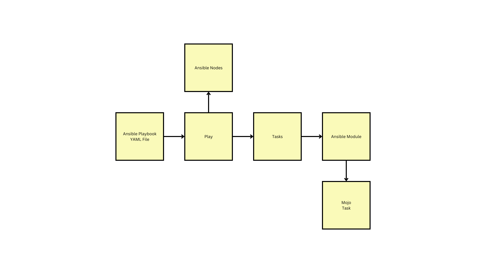

# Day 2

## Lab - Running your first Ansible ad-hoc command (ping)
```
cd ~/ansible-aug-2024
git pull
cd Day2/static-inventory
cat inventory
ansible -i inventory all -m ping
```

Expected output


## Lab - What happens when we execute the ansible ping ad-hoc command
```
cd ~/ansible-aug-2024
git pull
cd Day2/static-inventory
cat inventory
ansible -i inventory all -m ping -vvvv > output.yml 2>&1
```

<pre>
1. Ansible creates a temp directory on the Ansible Controller Machine (ACM)
2. Ansible parallely connects to ubuntu1 and ubuntu2 using SSH, fetching connection details from the inventory file
3. Ansible creates a temp directory on the ansible nodes(containers)
4. Ansible copies(sftp/ftp) from ACM machine to the ansible nodes into the temp directory
5. Ansible run the python ping.py script on the remote ansible nodes
6. Captures the output of ping.py execution on the remote ubuntu1 and ubuntu2, removes the temp directory that was created earlier
7. On the ACM machine, gives a summary of the output(status) of ping ad-hoc command
</pre>

## Lab - Listing all the ansible modules supported by your ansible version
```
ansible-doc -l
```

Expected output


## Lab - Finding machine facts
```
cd ~/ansible-aug-2024
git pull
cd Day2/static-inventory
ansible -i inventory ubuntu1 -m setup
```

Expected output


## Lab - Refactoring inventory with group variables
```
cd ~/ansible-aug-2024
git pull
cd Day2/static-inventory
cat inventory
cat hosts
ansible -i hosts all -m ping
```

Expected output


## Info - Structure of ansible playbook


## Lab - Installing Visual studio code using ansible playbook
```
cd ~/ansible-aug-2024
git pull
cd Day2/playbooks
ansible-playbook install-visual-studio-code-locally-playbook.yml --ask-become-pass
```
In the above command, when it prompts for admin password, you need to type 'Password@1' without quotes.

Expected output


## Lab - Install basic unix tool on ubuntu1 and ubuntu2 ansible node containers using ansible playbook
```
cd ~/ansible-aug-2024
git pull
cd Day2/playbooks
ansible-playbook -i hosts install-basictools-playbook.yml
```

Expected output


## Lab - Performing playbook syntax check or dry-run
```
cd ~/ansible-aug-2024
git pull
cd Day2/playbooks
ansible-playbook -i hosts install-basictools-playbook.yml --check
ansible-playbook -i hosts install-basictools-playbook.yml -C

ansible-playbook -i hosts install-basictools-playbook.yml --syntax-check
```

Expected output


## Lab - Using list variable in ansible playbook
```
cd ~/ansible-aug-2024
git pull
cd Day2/playbooks/loops
ansible-playbook -i hosts install-basictools-playbook.yml
```

Expected output


## Lab - Using dictionary variable in ansible playbook
```
cd ~/ansible-aug-2024
git pull
cd Day2/playbooks/loops
ansible-playbook -i hosts dictionary-playbook.yml
```


Expected output

